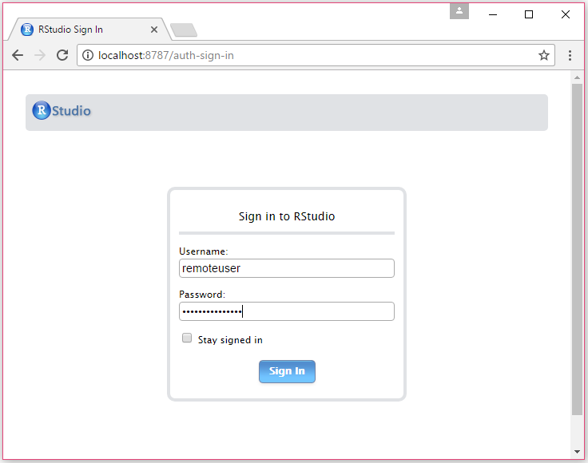

# This repository contains content for the MLADS Spring 2017 (June 8-9, 2017) tutorial "Operationalization using Microsoft R Server on single node machines and Spark clusters".


## Tutorial slides
[Operationalization with Microsoft R Server](./docs/MLADS2017_tutorial_slides.pptx)

## Prerequisites
* Please bring a wireless enabled laptop.
* Download free [Postman app](https://www.getpostman.com/) for API development.
* Make sure your machine has an ssh client with port-forwarding capability. On Mac or Linux, simply run the ssh command in a terminal window.
On Windows, download [plink.exe](https://the.earth.li/~sgtatham/putty/latest/x86/plink.exe)
from [here](http://www.chiark.greenend.org.uk/~sgtatham/putty/download.html). Alternatively, see [this page](./docs/linux.md) for details on the Windows shell options. 
* Provision a Linux CentOS Data Science VM (DSVM) on Azure Portal [**following these instructions**](./docs/dsvm_provisioning.md).
    * Make sure to provision **Standard DS12_V2** type. 
    * **IMPORTANT**: For the VM user name please use **remoteuser**!
* NOTE: If you did not specify the VM username as **remoteuser**, most of the tutorial content will not work.

## Connecting to the Data Science Virtual Machine on Microsoft Azure
We will provide Azure Data Science Virtual Machines (running Spark 2.0.2) for attendees to use during the tutorial. You will use your laptop to connect to your allocated virtual machine.

1. Connect to your DSVM
    * __Linux, Mac__, or __Windows Linux Shell__: Command line to connect using `ssh`: Replace XXX with the public IP address of your Data Science Virtual Machine (e.g. remoteuser@13.64.107.209)
    
    ```bash
    ssh -L localhost:8787:localhost:8787 remoteuser@XXX
    ```
    * __Windows__: Command line to connect with plink.exe - run the following commands in a Windows command prompt window - replace XXX with the public IP address of your Data Science Virtual Machine (e.g. remoteuser@13.64.107.209)
    
    ```bash
    cd directory-containing-plink.exe
    .\plink.exe -L localhost:8787:localhost:8787 remoteuser@XXX
    ```

    See [this page](./docs/linux.md) for details on the Windows shell options. 
    We are creating an SSH tunnel to the VM by mapping localhost:8787 on the VM to the client machine. This is the port on the VM opened to RStudio Server.

2. Once you are connected, become a root user on the cluster. In the SSH session, use the following command.

    ```bash
    sudo su -
    ```
    
3. Download the course material from the git repository using the following command

    ```bash
    git clone https://vapaunic.visualstudio.com/_git/mladss2017
    ```

4. Change the permissions on the custom script file and run the script. Use the following commands.

    ```bash
    cd mladss2017
    chmod +x DSVM_Customization_Script.sh
    dos2unix ./DSVM_Customization_Script.sh
    
    ./DSVM_Customization_Script.sh
    ```

5. After connecting via the above command lines, you can access RStudio Server by opening a web browser and typing the following URL. You will be prompted to sign in with your credentials.

    ```bash
    http://localhost:8787/ 
    ```

    


## Suggested Reading prior to tutorial date

### Microsoft R Server: 
Microsoft R Server general information: [https://msdn.microsoft.com/en-us/microsoft-r/rserver](https://msdn.microsoft.com/en-us/microsoft-r/rserver). 
Microsoft R Servers are installed on both Azure Linux DSVMs and HDInsight clusters (see below), and will be used to run R code in the tutorial.

### R-Server Operationalization service:
Microsoft R Server operationalization service general information: [https://msdn.microsoft.com/en-us/microsoft-r/operationalize/about](https://msdn.microsoft.com/en-us/microsoft-r/operationalize/about)

Configuring operationalization: [https://msdn.microsoft.com/en-us/microsoft-r/operationalize/configuration-initial](https://msdn.microsoft.com/en-us/microsoft-r/operationalize/configuration-initial)

### SparkR (Spark 2.0.2):
SparkR general information: [http://spark.apache.org/docs/latest/sparkr.html](http://spark.apache.org/docs/latest/sparkr.html)

SparkR 2.0.2 functions: [https://spark.apache.org/docs/2.0.2/api/R/index.html](https://spark.apache.org/docs/2.0.2/api/R/index.html)

### RevoScaleR:
RevoScaleR functions: [https://msdn.microsoft.com/en-us/microsoft-r/scaler/scaler](https://msdn.microsoft.com/en-us/microsoft-r/scaler/scaler)

## Platforms & services for hands-on exercises or demos
### Azure Linux DSVM (Data Science Virtual Machine)
Information on Linux DSVM: https://azuremarketplace.microsoft.com/en-us/marketplace/apps/microsoft-ads.linux-data-science-vm
The Linux DSVM has Spark (2.0.2) installed, as well as Yarn for job management, as well as HDFS. So, you can use the DSVM to run regular R code as well as code that run on Spark (e.g. using SparkR package). You will use DSVM as a single node Spark machine for hands-on exercises. We will provision these machines and assign them to you at the beginning of the tutorial.
