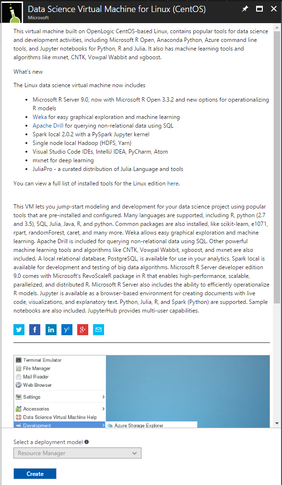
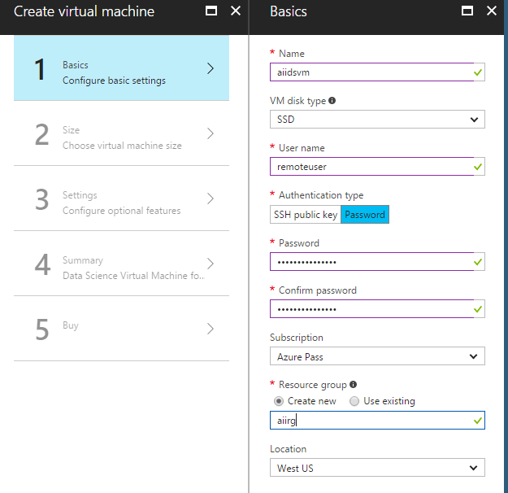

##  Steps to provision a Linux CentOS Data Science Virtual Machine for the tutorial

1. Log in to the [Azure portal](https://portal.azure.com) using your account.

   > [!NOTE]
   > If you do not have an Azure account, visit [Azure free trial](https://azure.microsoft.com/pricing/free-trial/).

2. On the Azure portal, click **New**. The portal opens the **New** blade. 
3. In the *Search the marketplace* text box type Data Science Virtual Machine for Linux, and press the ENTER key.
4. Select the Data Science Virtual Machine for Linux (CentOS) image, and click on **Create**.

5. Configure basic settings 
On the Basics blade, provide the following information:
- Enter a unique virtual machine name.
- **For the User name please use *remoteuser*!**
- Provide a strong Password.
- If you have multiple subscriptions, verify that the subscription is correct for the new VM.
- In the Resource group box, type a name for a new resource group. Alternatively, to use an existing resource group click Use existing. A resource group is a collection of related resources in Azure (virtual machines, storage accounts, virtual networks, etc.).
- Click OK to save the settings.

 

6. Choose virtual machine size
* On the Size step, choose a virtual machine size in the Choose a size blade. The blade initially displays recommended machine sizes based on the image you selected. 
* To select the machine for this tutorial, use the **View all** button which shows all machine size options. 
* Find DS12_V2 Standard configuration in the list and click Select.
 

7. Leave all other settings unchanged (click through remaining **OKs**)
8. On the last Buy blade click **Purchase**.

