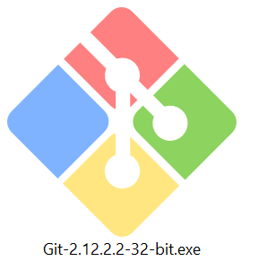
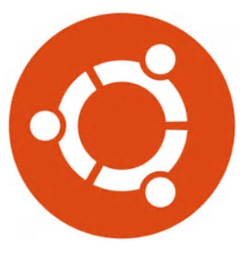

# Linux on Windows

These are assorted Linux toolsets you can install, which among other things, connect remotely to Linux. They are ordered roughly by ease-of-use. 

## 1. [Git for Windows](https://git-scm.com/download/win) 

Alongside offering a complete implementation of `git`, Git-Bash incidentally is a true `bash` shell, intended for running `git` from the command line. As an alternative way to ruj it, you also get Git-GUI with Git for Windows. 

Git for Windows comes with the POSIX infrastructure `git` expects such as `bash`, `perl`, many POSIX tools such as `ssh`, `sed`, `awk`, `tr`, etc. It does not include `python`. A nice feature is the automatic ssh certificate management that avoids password verification for each remote access. 

## 2. [PuTTY: latest release (0.69)](http://www.chiark.greenend.org.uk/~sgtatham/putty/latest.html)  

`Putty`  is a free and open-source terminal emulator, serial console and network file transfer application for Windows, and allows local, remote, or dynamic port forwarding with `ssh.` It's well known, and has been around for a long time.  `Putty` comes with `plink.exe` a command-line interface to the PuTTY back ends used for non-interactive sessions. As a terminal emulator, it does not include a local Linux shell. 

## 3. [Bash on Ubuntu for Windows](https://msdn.microsoft.com/en-us/commandline/wsl/about)  

Microsoft's port of Canonical's Ubuntu minus the GUI, as a _subsystem_ running on the Windows POSIX interface.  Still in beta, but not a VM or just a shell, it can install and run both Windows and Ubuntu binaries. (Really!) Installation takes time, space and involves several steps.

## 4. [Cygwin](https://www.cygwin.com/)  

The long-standing port of GNU tools to Windows, including a terminal emulator and X-Windows server. Includes a complete Linux toolchain for re-compiling linux source on Windows. 

## 5. Or, use `ssh` in the `Git-bash` shell that's available on your Windows DSVM.
