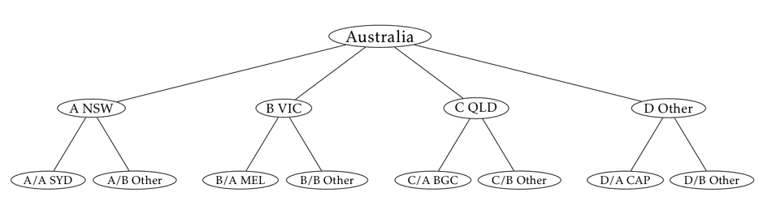

Training hierarchical time series forecasting models require searching through a large parameter space.

The model's performance greatly varies over the parameters we choose, some of which are: 

* univariate time series method for individual series prediction
* method for reconciling forecasts across hierarchy
* weights we use to reconcile forecasts across hierarchy
* etc.


This script uses Australian tourism data set from 'fpp' package as a sample data set. 

  Rob J Hyndman (2013). fpp: Data for "Forecasting: principles and practice". R package version 0.5.
  https://CRAN.R-project.org/package=fpp

This data set contains quarterly visitor nights spent by international tourists to Australia available for years 1999-2010. We will use this historical data to forecast nights spent by tourists in Australia:

* In total
* By state
* By city

This data can be represented as a hierarchy, as shown in the following picture:



The script:

1. creates hierarchical time series data set
2. splits the data into training and testing
3. generates a grid of input parameters for forecasting function
4. calls rxExec() to run forecasting over the parameter space distributed
    accross local cores or cluster nodes
5. finds optimal parameters based on all runs
6. forecasts the next two years using the optimal parameters


Let us first load necessary libraries

```{r Installing libraries, message = FALSE}
if(!require("hts")) install.packages('hts')
if(!require("fpp")) install.packages('fpp')

library(hts)
library(fpp)
```

We will use the following function for time series forecasting. The function runs hierarchical forecast on training data set
and returns evaluation metrics on test data set


```{r Forecasting function}
forecast_hts <- function (traindata, testdata, htsmethod, tsmethod, combweights){
  
  # Forecasting horizon
  horiz =  dim(aggts(testdata))[1]
  
  # Run hierarchical forecast
  hts_fcast <- forecast(object  = traindata, 
                        h       = horiz,
                        method  = htsmethod,
                        fmethod = tsmethod,
                        weights = combweights)
  
  # Return evaluation metrics at the top level
  fcast_acc <- accuracy.gts(hts_fcast, test = testdata, levels = 0)
  
}
```

Let's process the data

```{r Processing the data}
# Create hierachical time series dataset
htsdata <- hts(vn, nodes=list(4,c(2,2,2,2)))


# Rename the nodes of the hierarchy
htsdata$labels$`Level 1` <- c("NSW", "VIC", "QLD", "Other")
htsdata$labels$`Level 2` <- c("Sydney", "NSW-Other", "Melbourne", "VIC-Other", "BrisbaneGC", "QLD-Other", "Capitals", "Other")
names(htsdata$labels) <- c("Total", "State", "City")

# Split data into train and test (leave out years 2010 and 2011 for testing)
train_data <- window(htsdata,  end = c(2009, 4))
test_data <- window(htsdata, start = c(2010, 1))

```

Let's see what the hierarchical time series data looks like.

```{r Visualizing hts}
# Plot the hierarchial time series data
plot(htsdata)
```


Let's generate the parameter space

```{r Generating parameter space}
# Vary methods for generating base time series forecasts
ts_method <- c("ets", "arima", "rw")

# Vary methods for reconciling base forecasts to satisfy aggregation requirement
hts_method <- c("bu", "comb", "tdgsa", "tdgsf", "tdfp") 

# Vary forecast weights for the optimal cobination approach 
comb_weights <- c("none", "sd", "nseries")

# Generate all possible combinations of the above parameters
param_space <- expand.grid(hts_method, ts_method, comb_weights, stringsAsFactors = FALSE)
colnames(param_space) <- c("hts_method", "ts_method", "comb_weights")


# Remove ilegal combinations
#   - comb_weights only applies to hts_method == "comb"
rm_inds <- param_space$hts_method != "comb"
param_space$comb_weights[rm_inds] <- "none"
param_space <- param_space[!duplicated.data.frame(param_space),]

```

Setting up compute context

rxSetComputeContext("local") - sets compute context to "local" and causes rxExec() 
to execute runs locally in a serial manner.

rxSetComputeContext(RxLocalParallel()) - causes rxExec() to run multiple tasks 
in parallel, thereby using the multiple cores on your local machine. 
The downside is that this will use more memory and will slow down your computer 
for other work you may be trying to do at the same time.

rxSetComputeContext(RxSpark()) - for parallelized distributed execution via Spark 
across the nodes of a cluster

```{r Running distributed computation}
rxSetComputeContext(RxLocalParallel())

# Measure execution time
et <- system.time(
  
# Run many distributed jobs
rxResult <- rxExec(FUN            = forecast_hts,  
                   traindata      = train_data, 
                   testdata       = test_data, 
                   htsmethod      = rxElemArg(param_space$hts_method),  
                   tsmethod       = rxElemArg(param_space$ts_method),
                   combweights    = rxElemArg(param_space$comb_weights),
                   consoleOutput  = TRUE,
                   packagesToLoad = c('hts'))
)

cat(paste("Elapsed time: ", format(et['elapsed'], digits = 4), "seconds. \n"))

```


Collect the results of the rxExec(), and find the result with the bestevaluation metric (smallest MAPE)

```{r Getting optimal parameters}
all_mape <- sapply( rxResult, function(x) x["MAPE",] )
min_mape_indx <- which.min(all_mape)

# Optimal parameters
opt_params <- param_space[min_mape_indx,]

# Forecast the next 8 quarters using optimal parameters
horiz <- 8
hts_fcast <- forecast(object  = htsdata, 
                      h       = horiz,
                      method  = opt_params$hts_method,
                      fmethod = opt_params$ts_method)

```


Print out the optimal results

```{r Printing the results, echo=FALSE}
output <- paste("\n OPTIMAL RESULTS \n\n",
                "Minimum obtained MAPE: ", format(min(all_mape), digits = 4), "\n",
                "Optimal method for distributing forecasts within the hierarchy: ", opt_params$hts_method, "\n",
                "Optimal forecasting method: ", opt_params$ts_method, "\n")
cat(output)

if(opt_params$hts_method == "comb") cat(paste("Optimal weights used for `comb` method: ", opt_params$comb_weights, "\n"))

cat("\n Forecast for the next two years at the City level obtained using optimal parameters: \n\n")

print(aggts(hts_fcast, levels = 2))

# Plot the forecasted time series
names(hts_fcast$labels) <- c("Total", "State", "City")
plot(hts_fcast)
```


Let's generate larger data

```{r Generating larger data}
addNoise <- function(data) {
  
  data_dim <- dim(data)[1] * dim(data)[2]
  noise <- matrix(runif(data_dim, -500, 500), dim(data)[1])
  noisified <- data + noise
  return(noisified)
  
}

# Increase the number of time series by factor x
# TRY increasing this number
x = 2

larger_data <- coredata(vn)[ ,  rep(seq(ncol(vn)), x)]
larger_data <- addNoise(larger_data)


vnx <- ts(larger_data, frequency = 4, start = c(1998, 1))

# Create hierachical time series dataset
htsdata <- hts(vnx, nodes=list(4*x, rep(c(2,2,2,2), x)))

# Rename the nodes of the hierarchy
htsdata$labels$`Level 1` <- paste0('State_', 1:length(htsdata$labels$`Level 1`))
htsdata$labels$`Level 2` <- paste0('City_', 1:length(htsdata$labels$`Level 2`))
names(htsdata$labels) <- c("Total", "State", "City")

# Split data into train and test (leave out years 2010 and 2011 for testing)
train_data <- window(htsdata,  end = c(2009, 4))
test_data <- window(htsdata, start = c(2010, 1))

# TRY changing the compute context and see how it affects the execution time
rxSetComputeContext(RxLocalParallel())

# Measure execution time
et <- system.time(
  
  # Run many distributed jobs
  rxResult <- rxExec(FUN            = forecast_hts,  
                     traindata      = train_data, 
                     testdata       = test_data, 
                     htsmethod      = rxElemArg(param_space$hts_method),  
                     tsmethod       = rxElemArg(param_space$ts_method),
                     combweights    = rxElemArg(param_space$comb_weights),
                     consoleOutput  = TRUE,
                     packagesToLoad = c('hts'))
)

cat(paste("Elapsed time: ", format(et['elapsed'], digits = 4), "seconds. \n"))

all_mape <- sapply( rxResult, function(x) x["MAPE",] )
min_mape_indx <- which.min(all_mape)

# Optimal parameters
opt_params <- param_space[min_mape_indx,]

# Forecast the next 8 quarters using optimal parameters
horiz <- 8
hts_fcast <- forecast(object  = htsdata, 
                      h       = horiz,
                      method  = opt_params$hts_method,
                      fmethod = opt_params$ts_method)

plot(hts_fcast)
```